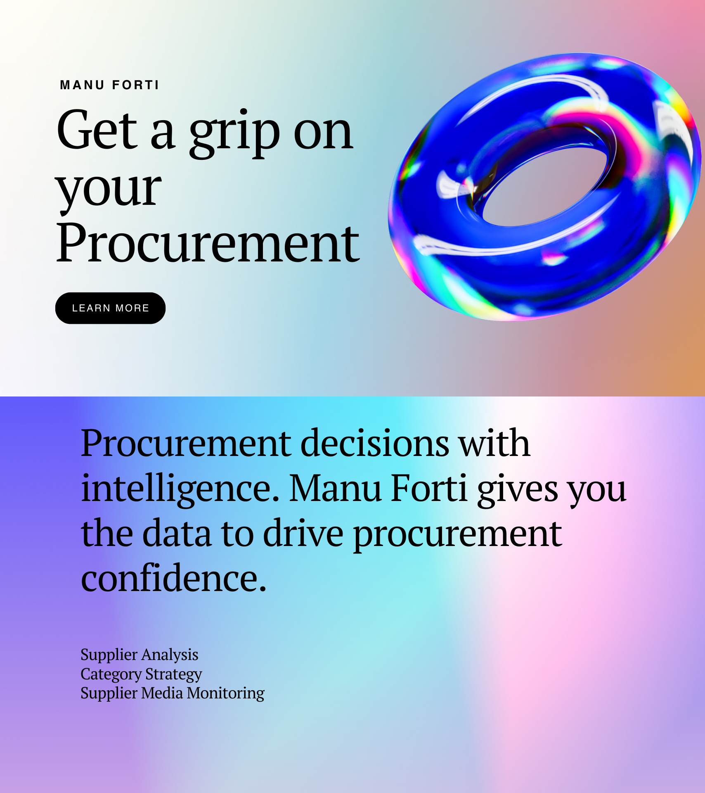

# Canva Button Integration — Manu Forti Website

## What It Does
Embeds Canva's design editor directly on your website. Visitors can customize Manu Forti-branded templates without leaving your site.

## Use Cases
- Let prospects customize their own sample report cover pages
- Allow customers to co-create procurement deliverables
- Offer branded templates they can personalize

---

## SETUP STEPS

### Step 1: Apply for Canva Developer Access
1. Go to https://www.canva.com/developers/
2. Click "Get started" or "Apply now"
3. Fill out the application:
   - **Company:** Manu Forti Intelligence
   - **Use case:** Embed Canva editor for procurement report customization
   - **Website:** manuforti.com
4. Wait for approval (1-3 business days)

### Step 2: Create Canva App
1. Go to https://www.canva.com/developers/apps/
2. Click "Create an app"
3. **App name:** Manu Forti Report Customizer
4. **App type:** "Canva Button" (embed in website)
5. Set redirect URI: `https://manuforti.com/canva-callback`
6. Get your **Client ID** and **Client Secret**

### Step 3: Create Template
1. In Canva, design your template (e.g., "Procurement Report Cover")
2. Click **Share** → **More** → **Canva Button**
3. Enable "Allow others to customize this design"
4. Copy the **Template ID**

### Step 4: Add to Website
Add this script to your HTML:

```html
<!-- Canva Button Script -->
<script src="https://sdk.canva.com/designbutton/v2/api.js"></script>

<!-- Canva Button Container -->
<div id="canva-button"></div>

<script>
  // Initialize Canva Button
  const api = await canva.init({
    apiKey: 'YOUR_CANVA_CLIENT_ID',
    container: '#canva-button',
  });

  // Create button
  api.createDesignButton({
    design: {
      type: 'Template',
      id: 'YOUR_TEMPLATE_ID', // From Step 3
    },
    button: {
      text: 'Customize Your Report',
      theme: 'default',
    },
    onDesignOpen: () => {
      console.log('Canva editor opened');
    },
    onDesignPublish: (exportData) => {
      console.log('Design saved:', exportData);
      // Send exportData.url to your backend
    },
  });
</script>
```

### Step 5: Handle Exports
When user finishes designing, Canva returns:
- Export URL (PNG/PDF of their design)
- Design ID

Save this to your database and associate with their order.

---

## EXAMPLE: Report Cover Customization

**Template you create in Canva:**
- Manu Forti branded cover page
- Placeholder for: Company name, Report title, Date
- Locked: Logo, color scheme, footer
- Editable: Title, subtitle, company name

**User experience:**
1. Clicks "Customize Your Report" on manuforti.com
2. Canva editor opens (embedded or popup)
3. They edit the placeholder text
4. Click "Publish" → Canva returns image URL
5. Your website saves the custom cover with their order

---

## LIMITATIONS

- ❌ **No programmatic design generation** (can't auto-create images via API)
- ❌ **Users need Canva account** (free works)
- ✅ **Users can customize templates** (what you want)
- ✅ **Exports are watermarked** unless they have Canva Pro

---

## ALTERNATIVE: Static Images (Easier)

If you just want professional hero images:

1. Use your existing hero-v1.png in the website
2. No API needed
3. Just reference in HTML:

```html

```

---

## RECOMMENDATION

**For now:** Use your existing hero-v1.png (static image) — it's already designed and professional.

**Later:** Apply for Canva Button if you want customers to customize their report covers.

---

## FILES YOU ALREADY HAVE

- `hero-v1.png` — 1920x1080 hero image
- `hero-v2.png` — Alternative version
- `canva_stripe_hero_guide.md` — Design specs
- `canva_hero_brief.md` — Original brief

**Next step:** Just update `index.html` to use hero-v1.png
